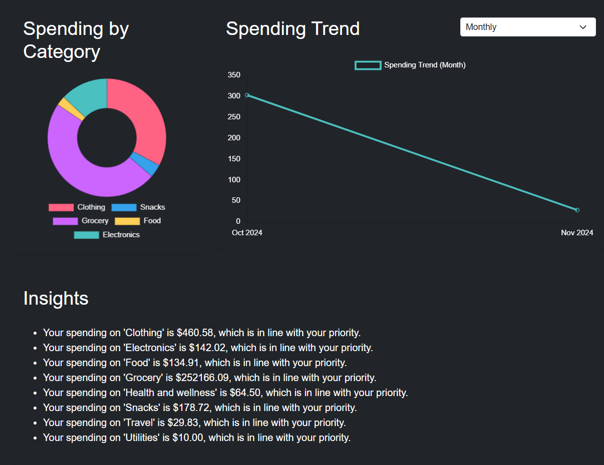

# Smart Finance Tracker

As a university student, I know firsthand how easy it is to lose track of expenses and go over budget. The Smart Finance Tracker is designed to help students (and anyone else) better manage their finances, prioritize spending, and make informed financial decisions.

This web application provides an easy-to-use dashboard for tracking expenses, setting spending priorities, and visualizing trends over time. With interactive charts, budget insights, and simple controls, it helps users stay on top of their finances and take control of their spending habits.

## Features
- **Track Transactions**: Record and categorize expenses effortlessly.
- **Set Spending Priorities**: Use a star rating system to prioritize where your money goes.
- **Budget Insights**: Receive actionable insights to help improve budgeting based on your spending habits.
- **Interactive Charts**: Visualize spending by category and over time with easy-to-understand charts.

## Technologies Used
- **Backend**: Flask
- **Database**: MySQL
- **Frontend**: HTML, CSS (Bootstrap), JavaScript (Chart.js)

## How to Run the Project

1. **Clone the repository**:
   ```bash
   git clone https://github.com/sebasajeed/Smart-Finance-Tracker.git
   cd Smart-Finance-Tracker
   ```

2. **Set up a virtual environment**:
   ```bash
   python3 -m venv env
   source env/bin/activate  # On Windows, use `env\Scripts\activate`
   ```

3. **Install dependencies**:
   ```bash
   pip install -r requirements.txt
   ```

4. **Set up the database**:
   - Create a MySQL database named `finance_tracker`.
   - Run the provided SQL script to create necessary tables:
     ```bash
     mysql -u your_username -p finance_tracker < setup.sql
     ```
     Replace `your_username` with your MySQL username.

5. **Run the application**:
   ```bash
   python app.py
   ```

6. **Access the application**:
   - Open your browser and go to `http://127.0.0.1:5000`.

## Screenshots

### Spending by Category & Spending Trend


### Insights & Monthly Spending Trend


### Set Spending Priorities


## Contributing
Contributions are welcome! Feel free to open issues or submit pull requests.

## License
This project is open source and available under the [MIT License](LICENSE).

## Acknowledgments
- Thanks to all university students who inspired the idea for this project by sharing their budgeting challenges.

